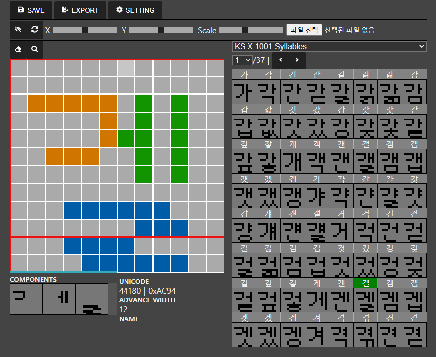
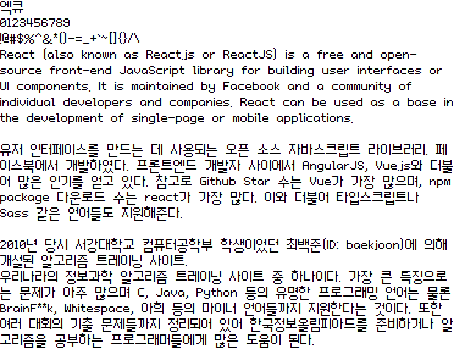

# Pixel Font Maker

픽셀 폰트를 디자인하고 TTF, WOFF2, BDF 파일로 뽑을 수 있는 프로그램입니다.

## 샘플 폰트

[Project + TTF](https://blog.naver.com/exqt_/222480693731)

## 조작
### 보드
- mouse (left, right) (칠하기, 지우기)
- keyboard (left, right, up, down) (보드 이동)
- ctrl + (z, x, c, v) (되돌리기, 자르기, 복사, 붙여넣기)
- (1, 2, 3) (브러시 크기 조절)
### 기타
- ctrl+s (프로젝트 저장)
- Components에서 컴포넌트를 좌클릭하면 해당 컴포넌트를 편집합니다. 우클릭하면 해당 컴포넌트를 지울 수 있습니다.
- 컴포넌트를 선택한 다음 ctrl+g를 누르면 해당 컴포넌트를 가지는 글리프들을 모아 글리프셋을 만듭니다.

## 프로젝트 속성
- Descent : baseline 기준으로 가장 아래쪽까지의 길이
- Ascent : baseline 기준으로 가장 위쪽까지의 길이
- WidthType
  - Monospace : 모든 글리프가 너비가 Fixed-Width의 배수가 되도록 설정됩니다.
  - Proportional : 글리프의 너비가 (가장 오른쪽에 있는 픽셀까지의 X거리) + (Letter Spacing) 가 되도록 설정됩니다.
  - 위의 규칙과 다르게 너비를 설정하고 싶다면 에디터 하단에 Advance Width를 클릭해서 설정하면 됩니다.

## 한글 폰트 작성법 & 한글 템플릿
한글 템플릿을 사용하면 모든 한글 글자 (11172자) 를 하나하나 찍는 대신 형태에 맞게 초성, 중성, 종성을 따로 찍어 조합하는 식으로 작업량이 줄어듭니다. (172개 또는 344개 자모만 찍으면 됩니다.)

1. 프로젝트를 만들 때 한글 템플릿을 선택 (자모 컴포넌트가 `Private Set` 글리프셋에서 생성됩니다.)
2. `Korean Syllable (모든 11172자)` 또는 `KS X 1001 Korean Syllable (자주 쓰는 2350자)` 글리프셋을 선택
3. Components 에서 자모 컴포넌트를 선택해서 그리기

### ZIK님 4x2x2 템플릿
- 출처 : [ZIK님 GMS 한글 조합 렌더링](https://github.com/TandyRum1024/hangul-johab-render-gms#%EA%B8%80%EA%BC%B4-%EA%B4%80%EB%A0%A8)
- 초성 4벌, 중성 2벌, 종성 2벌 `(4*19 + 2*21 + 2*27) = 172자`
- 초성 : 총 4벌 (4줄)
    - 1벌 : 받침 있고 중성 `[ㅏ ㅐ ㅑ ㅒ ㅓ ㅔ ㅕ ㅖ ㅣ]` 와 결합 (EX : `먄, 먠, 미`)
    - 2벌 : 받침 있고 중성 `[ㅗ ㅘ ㅙ ㅚ ㅛ ㅜ ㅝ ㅞ ㅟ ㅠ ㅡ ㅢ]` 와 결합 (EX : `옹, 왱, 융`)
    - 3벌 : 받침 없고 중성 `[ㅏ ㅐ ㅑ ㅒ ㅓ ㅔ ㅕ ㅖ ㅣ]` 와 결합 (EX : `개, 네, 아`)
    - 4벌 : 받침 없고 중성 `[ㅗ ㅘ ㅙ ㅚ ㅛ ㅜ ㅝ ㅞ ㅟ ㅠ ㅡ ㅢ]` 와 결합 (EX : `오, 뇌, 위`)
- 중성 : 총 2벌 (2줄)
    - 1벌 : 받침 있는 글자의 중성부분 (EX : `감, 괨, 굼`)
    - 2벌 : 받침 없는 글자의 중성부분 (EX : `오, 우, 야`)
- 종성(받침) : 총 2벌 (2줄)
    - 1벌 : 중성 `[ㅏ ㅐ ㅑ ㅒ ㅓ ㅔ ㅕ ㅖ ㅣ]` 와 결합 (EX : `펭, 귄, 웱`)
    - 2벌 : 중성 `[ㅗ ㅘ ㅙ ㅚ ㅛ ㅜ ㅝ ㅞ ㅟ ㅠ ㅡ ㅢ]` 와 결합 (EX : `뫔, 뭄, 밈`)

### 도깨비한글 8x4x4벌식 글꼴
- 출처 : [ZIK님 GMS 한글 조합 렌더링](https://github.com/TandyRum1024/hangul-johab-render-gms#%EA%B8%80%EA%BC%B4-%EA%B4%80%EB%A0%A8)
- 초성 8벌, 중성 4벌, 종성 4벌 `(8*19 + 4*21 + 4*27) = 344자`
- 초성 : 총 8벌 (8줄)
    - 1벌 : 받침없는 `[ㅏ ㅐ ㅑ ㅒ ㅓ ㅔ ㅕ ㅖ ㅣ]` 와 결합
    - 2벌 : 받침없는 `[ㅗ ㅛ ㅡ]`
    - 3벌 : 받침없는 `[ㅜ ㅠ]`
    - 4벌 : 받침없는 `[ㅘ ㅙ ㅚ ㅢ]`
    - 5벌 : 받침없는 `[ㅝ ㅞ ㅟ]`
    - 6벌 : 받침 ***있는*** `[ㅏ ㅐ ㅑ ㅒ ㅓ ㅔ ㅕ ㅖ ㅣ]` 와 결합
    - 7벌 : 받침있는 `[ㅗ ㅛ ㅜ ㅠ ㅡ]`
    - 8벌 : 받침있는 `[ㅘ ㅙ ㅚ ㅢ ㅝ ㅞ ㅟ]`
- 중성 : 총 4벌 (4줄)
    - 1벌 : 받침없는 `[ㄱ ㅋ]` 와 결합 (EX : `괴, 가, 큐, 캬`)
    - 2벌 : 받침없는 `[ㄱ ㅋ]` 이외의 자음과 결합 (EX : `외, 나, 류, 먀`)
    - 2벌 : 받침 ***있는*** `[ㄱ ㅋ]` 와 결합 (EX : `광, 쾅, 굉, 괽`)
    - 3벌 : 받침있는 `[ㄱ ㅋ]` 이외의 자음과 결합 (EX : `웅, 얅, 약, 약`)
- 종성 : 총 4벌 (4줄)
    - 1벌 : 중성 `[ㅏ ㅑ ㅘ]` 와 결합
    - 2벌 : 중성 `[ㅓ ㅕ ㅚ ㅝ ㅟ ㅢ ㅣ]`
    - 3벌 : 중성 `[ㅐ ㅒ ㅔ ㅖ ㅙ ㅞ]`
    - 4벌 : 중성 `[ㅗ ㅛ ㅜ ㅠ ㅡ]`

### minzkn님 10x6x4벌식 글꼴
- 출처 : [UnBitFonts](https://sites.google.com/site/unbitfonts/composite)
- 초성 10벌, 중성 6벌, 종성 4벌 `(10*19 + 6*21 + 4*27) = 424자`
- 초성 : 총 10벌
    - 1벌 : `받침 없는 [ㅏ ㅐ ㅑ ㅒ ㅓ ㅔ ㅕ ㅖ ㅣ]`
    - 2벌 : `받침 없는 [ㅗ ㅛ ㅡ]`
    - 3벌 : `받침 없는 [ㅜ ㅠ]`
    - 4벌 : `받침 없는 [ㅘ ㅙ ㅚ ㅢ]`
    - 5벌 : `받침 없는 [ㅝ ㅞ ㅟ]`
    - 6벌 : `받침 있는 [ㅏ ㅐ ㅑ ㅒ ㅓ ㅔ ㅕ ㅖ ㅣ]`
    - 7벌 : `받침 있는 [ㅗ ㅛ ㅡ]`
    - 8벌 : `받침 있는 [ㅜ ㅠ]`
    - 9벌 : `받침 있는 [ㅘ ㅙ ㅚ ㅢ]`
    - 10벌 : `받침 있는 [ㅝ ㅞ ㅟ]`
- 중성 : 총 6벌
    - 1벌 : `받침 없는 초성 [ㄱ ㅋ] 과 결합`
    - 2벌 : `받침 있는 초성 [ㅎ] 과 결합`
    - 3벌 : `받침 없는 초성 [ㄱ ㅋ ㅎ] 이외의 초성과 결합`
    - 4벌 : `받침 있는 초성 [ㄱ ㅋ] 과 결합`
    - 5벌 : `받침 있는 초성 [ㅎ] 과 결합`
    - 6벌 : `받침 있는 초성 [ㄱ ㅋ ㅎ] 이외의 초성과 결합`
- 종성 : 총 4벌
    - 1벌 : `중성 [ㅏ ㅑ ㅘ ㅣ]`
    - 2벌 : `중성 [ㅓ ㅕ ㅚ ㅝ ㅟ ㅢ]`
    - 3벌 : `중성 [ㅐ ㅒ ㅔ ㅖ ㅙ ㅞ]`
    - 4벌 : `중성 [ㅗ ㅛ ㅜ ㅠ ㅡ]`

### hanterm 10x{3,4}x4벌식 글꼴
- 출처 : [UnBitFonts](https://sites.google.com/site/unbitfonts/composite)
- 초성 10벌, 중성 {3,4}벌, 종성 4벌 `(10*19 + (3*14 + 4*7) + 4*27) = 368자`
- 초성 : 총 10벌
    - 1벌 : `받침 없는 [ㅏ ㅐ ㅑ ㅒ ㅓ ㅔ ㅕ ㅖ ㅣ]`
    - 2벌 : `받침 없는 [ㅗ ㅛ ㅡ]`
    - 3벌 : `받침 없는 [ㅜ ㅠ]`
    - 4벌 : `받침 없는 [ㅘ ㅙ ㅚ ㅢ]`
    - 5벌 : `받침 없는 [ㅝ ㅞ ㅟ]`
    - 6벌 : `받침 있는 [ㅏ ㅐ ㅑ ㅒ ㅓ ㅔ ㅕ ㅖ ㅣ]`
    - 7벌 : `받침 있는 [ㅗ ㅛ ㅡ]`
    - 8벌 : `받침 있는 [ㅜ ㅠ]`
    - 9벌 : `받침 있는 [ㅘ ㅙ ㅚ ㅢ]`
    - 10벌 : `받침 있는 [ㅝ ㅞ ㅟ]`
- 중성 : 총 3+4벌
    - [ㅏㅐㅑㅒㅓㅔㅕㅖㅜㅝㅞㅟㅠㅣ]
        - 1벌 : `받침 없음`
        - 2벌 : `받침 [ㄴ] 과 결합`
        - 3벌 : `받침 [ㄴ] 이외의 받침과 결합`
    - [ㅗㅘㅙㅚㅛㅡㅢ]
        - 4벌 : `받침 없는 초성 [ㄱ ㅋ] 과 결합`
        - 5벌 : `받침 없는 초성 [ㄱ ㅋ] 이외의 초성과 결합`
        - 6벌 : `받침 있는 초성 [ㄱ ㅋ] 과 결합`
        - 7벌 : `받침 있는 초성 [ㄱ ㅋ] 이외의 초성과 결합`
- 종성 : 총 4벌
    - 1벌 : `중성 [ㅏ ㅑ ㅘ ㅣ]`
    - 2벌 : `중성 [ㅓ ㅕ ㅚ ㅝ ㅟ ㅢ]`
    - 3벌 : `중성 [ㅐ ㅒ ㅔ ㅖ ㅙ ㅞ]`
    - 4벌 : `중성 [ㅗ ㅛ ㅜ ㅠ ㅡ]`
